# AI-Powered Research-to-Content — Create & Publish with AI Agents


---

## Project Overview

**Insight2Post** converts a short campaign brief into researched, platform-specific content automatically.
Give it one row in a Google Sheet and it will:

1. Search for source material using **Tavily**.
2. Aggregate raw content.
3. Produce a LinkedIn post, an X/Twitter post, and a short two-paragraph blog.
4. Persist the outputs back to the sheet for audit and publishing.

The repo README below is laid out so technical and non-technical stakeholders can quickly understand the flow, configuration, and outputs with embedded agent prompts directly within each step.

---

## Who benefits & Problems Solved ✅

**Who benefits**

* Marketing and content teams producing cross-platform posts.
* Agencies needing repeatable content pipelines.
* Growth/community teams that require fast, consistent output.

**Problems this solves**

* Manual research + multi-format drafting is slow and inconsistent.
* Hard to convert research into tailored posts that respect platform norms.
* No single source of truth — this pipeline centralizes inputs and outputs.

---

## Key benefits ✨

* **Speed:** Brief → multi-platform content in minutes.
* **Consistency:** System prompts keep voice and structure consistent per platform.
* **Auditability:** All inputs/outputs recorded in Google Sheets.
* **Flexibility:** Swap models, adjust Tavily params, add platforms with minimal changes.

---

## Workflow diagram 📷

.JPG)

---

## Mermaid visual workflow

```mermaid
flowchart TD
  subgraph TestingEnv["Testing Environment"]
    A1["Manual: Execute workflow"]
    A2["Google Sheets → Get Campaign (Sheet1)"]
    A3["Limit → Max 1"]
    A4["Edit Field → Set Search fields for TAVILY"]
    A5["HTTP Request → TAVILY Search (POST)"]
    A6["Split Out Results (results)"]
    A7["Aggregate → data: title, raw_content"]
  end

  subgraph Agents["AI Agents & Persistence"]
    B1["LinkedIn Content Creator (gpt-4.1-mini)"]
    B2["Twitter Content Creator (gpt-4.1-mini1)"]
    B3["Blog Writer (gpt-4.1-mini2)"]
    B4["Google Sheets → Update row"]
  end

  A1 --> A2 --> A3 --> A4 --> A5 --> A6 --> A7 --> B1 --> B2 --> B3 --> B4

  subgraph ProductionEnv["Production Environment"]
    P1["Google Sheets Trigger → Row Added (poll every minute)"]
  end

  P1 --> A4
```



---

## Node-by-node configuration (Testing flow) 

> **Important:** In *testing* use Steps 1–3 (manual trigger → get → limit). In *production* replace them with the Google Sheets trigger described after the steps.

### Step 1 — Manual trigger: `Execute workflow`

* Purpose: Manual run to test one campaign row.

### Step 2 — Google Sheets: **Get Campaign**

* Credential: `Google Sheets AIS`
* Resource: `Sheet Within Document`
* Operation: `Get Row(s)`
* Document: `13. Research and Content Creation`
* Sheet: `Sheet1`
* Filters: none (UI said “Currently no items exist”)
* Combine Filters: `AND`

### Step 3 — **Limit**

* Max Items: `1`
* Keep: `Last Items`

### Step 4 — **Edit Field: Set Search fields for TAVILY**

* Mode: `Manual Mapping`
* Fields to set:

  * `query` (String) = `{{ $json['Content Subject'] }}`
  * `targetAudience` (String) = `{{ $json['Target Audience'] }}`

### Step 5 — **HTTP Request: TAVILY Search** (POST)

* URL: `https://api.tavily.com/search`
* Auth: Header Auth → `Tavily Credentials AIS`
* Body Content Type: `JSON`
* Body (verbatim):

```json
{
  "query": "{{ $json.query }}",
  "search_depth": "basic",
  "include_answer": true,
  "topic": "news",
  "include_raw_content": true,
  "max_results": 3
}
```

### Step 6 — **Split Out Results**

* Fields to split: `results`

### Step 7 — **Aggregate**

* Aggregate: `All Item Data (Into a Single List)`
* Put output in: `data`
* Fields to include (verbatim from UI): `title,, raw_content`

---

### Step 8 — **LinkedIn Content Creator (AI Agent)** 💼

* Model (UI icon): `gpt-4.1-mini`
* Prompt (User message):

```
Article Content: {{ $json.data.toJsonString() }}

Target Audience: {{ $('Set Search fileds for TAVILY').item.json.targetAudience }}
```

* Require Specific Output Format: enabled
* Enable Fallback Model: enabled

**System message (embedded for this step):**

```
# System Role  
You are an expert LinkedIn content creator specializing in transforming incoming articles into highly engaging posts tailored to a specific target audience.

# Task Specification  
Using the provided article, craft a LinkedIn post that is:
1. Written in a concise, engaging tone optimized for readability on mobile.
2. Tailored specifically to the target audience’s interests, needs, and professional goals.
3. Plain text only, with frequent line breaks for clarity.
4. Incorporates 1-2 emojis to enhance personality and appeal.
5. Provides actionable value and includes a clear call to action.
6. Contains 3-5 relevant hashtags.
7. Outputs only the post text—nothing else.
```

---

### Step 9 — **Twitter / X Content Creator (AI Agent)** 🐦

* Model (UI icon): `gpt-4.1-mini1`
* Prompt (User message):

```
Article Content: {{ $('Aggregate').item.json.data.toJsonString() }}

Target Audience: {{ $('Set Search fileds for TAVILY').item.json.targetAudience }}
```

* Require Specific Output Format: enabled
* Enable Fallback Model: enabled

**System message (embedded for this step):**

```
# System Role
You are an expert Twitter content creator specializing in transforming articles into engaging, concise tweets tailored to a specific target audience.

# Task Specification
Using the provided article, craft a tweet that is:
1. Short, concise, and optimized for Twitter’s character limit (280 characters).
2. Tailored to resonate with the target audience’s interests, needs, and goals.
3. Incorporates 1-2 emojis to enhance personality and appeal.
4. Offers value or insight and includes a clear call to action.
5. Contains 1-3 relevant hashtags.
6. Outputs only the tweet text—nothing else.
```

---

### Step 10 — **Blog Writer (AI Agent)** ✍️

* Model (UI icon): `gpt-4.1-mini2`
* Prompt (User message):

```
Article Content: {{ $('Aggregate').item.json.data.toJsonString() }}

Target Audience: {{ $('Set Search fileds for TAVILY').item.json.targetAudience }}
```

* Require Specific Output Format: enabled
* Enable Fallback Model: enabled

**System message (embedded for this step):**

```
# System Role
You are a skilled and creative blog writer, capable of crafting engaging, concise, and well-structured two-paragraph blog articles based on provided content.

# Task Specification
Write a two-paragraph blog article using the provided content. The blog should be coherent, engaging, and informative, tailored to a general audience. Ensure the tone is professional yet approachable, and the structure flows logically from introduction to conclusion.
```

---

### Step 11 — **Google Sheets: Update row** (persist outputs)

* Credential: `Google Sheets AIS`
* Resource: `Sheet Within Document`
* Operation: `Update Row`
* Document: `13. Research and Content Creation`
* Sheet: `Sheet1`
* Mapping column mode: `Map Each Column Manually`
* Column to match on: `Campaign`
* Values to update:

  * `Campaign`: `{{ $('Google Sheets Trigger').item.json.Campaign }}`
  * `LinkedIn`: `{{ $('LinkedIn Content Creator').item.json.output }}`
  * `X`: `{{ $('Twitter Content Creator').item.json.output }}`
  * `Blog`: `{{ $json.output }}`

---

## Production environment — replace testing trigger

Replace Steps 1–3 (manual trigger / Get Row / Limit) with a **Google Sheets Trigger**:

* Credential: `Google Sheets AIS`
* Poll mode: **Every Minute**
* Document: `13. Research and Content Creation`
* Sheet: `Sheet1`
* Trigger on: **Row Added**

When a new row is added the trigger enters Step 4 (Set Search fields for TAVILY) and the pipeline runs the same as above.

---

## Example input → outputs (concise sample) 🧪

**Sample sheet row**

* `Campaign`: `campaign-001`
* `Content Subject`: `How hybrid teams cut down hiring time`
* `Target Audience`: `Startup Founders & Talent Leads`

**Tavily request** (Step 5 payload)

```json
{
  "query": "How hybrid teams cut down hiring time",
  "search_depth": "basic",
  "include_answer": true,
  "topic": "news",
  "include_raw_content": true,
  "max_results": 3
}
```

**Sample LinkedIn output**

```
🔥 Hiring faster without sacrificing quality

Startup founders — hybrid teams can shorten time-to-hire while widening your talent pool. Here’s how:
1. Standardize interview scorecards for faster comparison.
2. Use async interview tasks to screen more candidates quickly.
3. Centralize hiring notes in one place for quick decisions.

Try these in your next hiring sprint and share what worked.  
#Hiring #Startup #TalentAcquisition #RemoteWork
```

**Sample Tweet**

```
Hybrid teams + async interviews = faster hires. Try standard scorecards + async tasks to speed screening. What’s your fastest hiring hack? 🚀 #Hiring #Startups
```

**Sample Blog (2 paragraphs)**

```
Hybrid work models are helping startups reduce hiring timelines by combining remote reach with structured local processes. Standardized interview scorecards and asynchronous screening tasks allow teams to evaluate more candidates efficiently while keeping quality high.

To implement this, centralize candidate notes, automate scheduling for local interviews, and use short async tasks for initial screening. These steps reduce bottlenecks and help teams make faster, more confident hiring decisions.
```

---

## Free workflow template (download) ⬇️

- **Download**: [Product Video Generation Workflow Template](https://github.com/SachinSavkare/Research-and-Content-Creation-Agents-Multi-Agents-n8n/blob/main/13.%20Research%20and%20Content%20Creation%20Agents.json)

---

## 👨‍💻 Author

**Sachin Savkare** — 📧 `sachinsavkare08@gmail.com`

---
